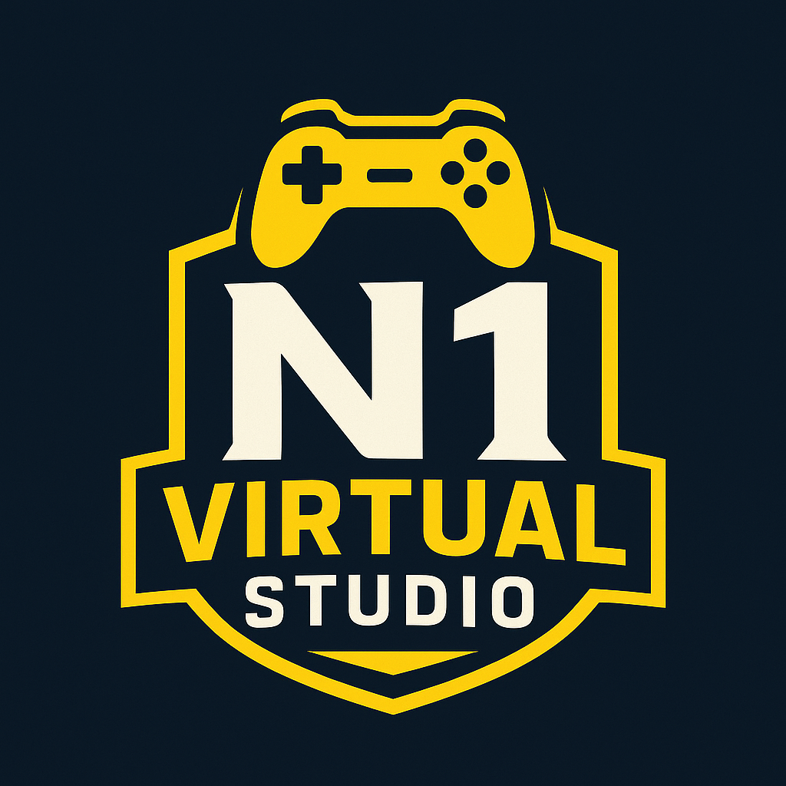

# Portfólio Colaborativo N1 Virtual Studio



Este repositório apresenta um portfólio colaborativo desenvolvido para o "N1 Virtual Studio", destacando as habilidades individuais de cada desenvolvedor e a sinergia do trabalho em equipe através de projetos integrados. Nosso objetivo é demonstrar a capacidade de transformar ideias em soluções eficientes, funcionais e bem projetadas.

## 🚀 Visão Geral do Projeto

O portfólio é uma plataforma interativa que serve como vitrine para os talentos dos nossos desenvolvedores. A página inicial (`Index.html`) oferece uma experiência visual dinâmica, permitindo aos visitantes explorar os perfis individuais de cada membro da equipe, onde encontrarão informações detalhadas sobre suas especialidades, projetos e formas de contato.

## 📂 Estrutura do Repositório

A organização do projeto segue uma estrutura clara para facilitar a navegação e manutenção:

## ✨ Funcionalidades Principais

*   **Página Inicial Dinâmica**:
    *   Apresenta os perfis dos desenvolvedores com um efeito de hover que expande o perfil, revelando uma breve descrição e convidando à exploração.
    *   Transições suaves e responsivas para uma experiência de usuário agradável.
*   **Páginas de Perfil Detalhadas**: Cada desenvolvedor possui uma página dedicada que inclui:
    *   **Seção Hero**: Uma introdução impactante com título e uma breve auto-descrição.
    *   **Seção "About Me"**: Informações aprofundadas sobre a trajetória, paixões e tecnologias dominadas, complementadas por logos das linguagens e ferramentas.
    *   **Seção "Projects"**: Uma galeria de vídeos interativa para exibir trabalhos relevantes, com funcionalidade de navegação entre os projetos.
    *   **Seção "Contact"**: Múltiplas opções de contato (Discord, WhatsApp, Email) para facilitar a comunicação.
*   **Design Responsivo**: O layout é totalmente adaptável, garantindo uma visualização otimizada em desktops, tablets e dispositivos móveis.
*   **Animações e Transições**: Utilização de CSS para criar animações de entrada de elementos e transições de hover, adicionando um toque profissional e moderno.
*   **Integração de Ícones e Fontes**: Uso de Font Awesome para ícones sociais e Google Fonts (`Open Sans`) para uma tipografia consistente e legível.

## 🛠️ Tecnologias Utilizadas

Este projeto foi construído utilizando as seguintes tecnologias web padrão:

*   **HTML5**: Para a estruturação semântica e acessível do conteúdo.
*   **CSS3**: Para estilização, layout responsivo e animações visuais.
    *   Variáveis CSS (`:root`) para gerenciamento de cores e espaçamentos.
    *   Flexbox e Grid para layouts flexíveis.
    *   Pseudo-classes (`:hover`, `:has`) para interatividade avançada.
*   **JavaScript**: Para adicionar interatividade dinâmica, como a navegação na galeria de vídeos.
*   **Font Awesome**: Para a inclusão de ícones escaláveis e vetoriais.
*   **Google Fonts**: Para a importação de fontes personalizadas, garantindo uma estética moderna.

## 👥 Colaboradores

Este portfólio é o resultado do esforço colaborativo de:

*   **João Schweitzer**
    *   **Função**: Dev Junior Full-Stack
    *   **Especialidades**: Python, Java, HTML, JavaScript, Sistemas Embarcados, Hardware, Automação.
    *   **Interesses**: Inteligência Artificial, Desenvolvimento Web Full-Stack.
    *   **Perfil**: [Página de João Schweitzer](PagJoao.html)
    *   **LinkedIn**: [João Schweitzer](https://br.linkedin.com/in/joão-schweitzer?trk=people-guest_people_search-card)
    *   **Instagram**: [@joao.Schweitzer](https://www.instagram.com/joao.Schweitzer/)

*   **Veperxz**
    *   **Função**: Desenvolvedor de Jogos
    *   **Especialidades**: Lua, Python, PHP, Unity, Unreal Engine, C#, C++.
    *   **Foco**: Transformar conceitos criativos em experiências de jogo imersivas e tecnicamente robustas.
    *   **Perfil**: [Página de Veperxz](PagVeperxz.html)
    *   **Instagram**: [@sanches.ghz](https://www.instagram.com/sanches.ghz/)

## 🚀 Como Rodar o Projeto Localmente

Para ter uma cópia local deste projeto em execução, siga os passos abaixo:

1.  **Clone o repositório**:
    ```bash
    git clone https://github.com/seu-usuario/Portifolio-Colaborativo.git
    ```
    (Substitua `seu-usuario` pelo nome de usuário ou organização real do repositório, se aplicável).

2.  **Navegue até o diretório do projeto**:
    ```bash
    cd Portifolio-Colaborativo
    ```

3.  **Abra o arquivo `Index.html`**:
    Simplesmente abra o arquivo `Index.html` em seu navegador web preferido (Google Chrome, Mozilla Firefox, etc.). Não é necessário um servidor web para a visualização básica.

---

Feito com ❤️ por N1 Virtual Studio
